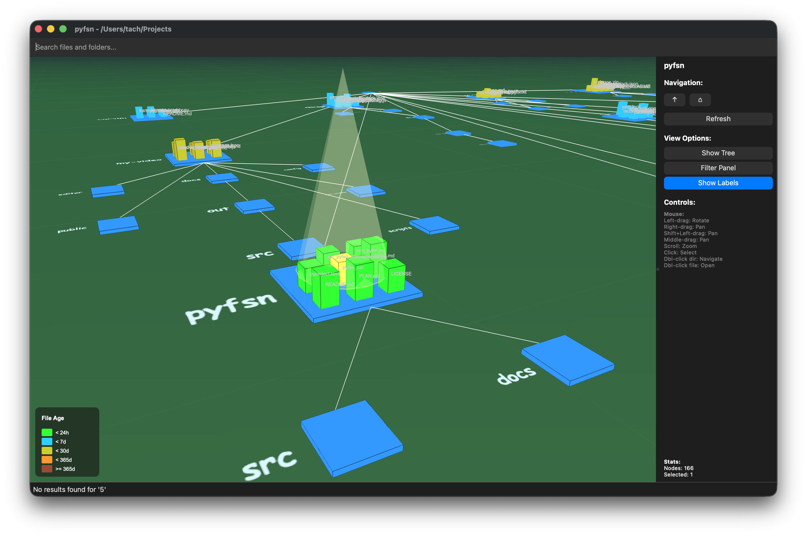

# pyfsn - Python File System Navigator

A 3D interactive file system visualization tool inspired by SGI IRIX fsn—the legendary interface used in Jurassic Park to "lock the door."


## Screenshot


It's a Unix System... I know this.

## Overview

pyfsn provides an immersive 3D visualization of your file system. Directories appear as platforms, files as cubes on those platforms, with height representing file size and color indicating file age. Navigate freely through your file system in 3D space.

## Features

- **3D Visualization**: Explore directory structures in an interactive 3D space
- **Dual Camera Modes**: Orbit (rotate/zoom/pan) and Fly (FPS-style WASD + Mouse Look with collision detection)
- **GPU-Accelerated Rendering**: PyOpenGL (Legacy OpenGL 2.1) for compatibility; ModernGL renderer also available
- **Real-time Search with Spotlight**: Visual search effects that highlight matching nodes with cone spotlights
- **Advanced Filtering**: Filter by size, age, and type with context preservation
- **Wire Connections**: Visual parent-child relationships between directories
- **File Age Colors**: Color-coded by modification time (SGI fsn style)
- **File Tree View**: Traditional hierarchical view alongside 3D visualization
- **Media Previews**: Hover over image files for thumbnails; video files show dynamic 4-scene digest playback (background threaded)
- **Theme System**: Multiple themes (SGI Classic, Dark Mode, Cyberpunk, Solarized, etc.)
- **Bloom & Emissive Effects**: File type-based glow effects and animated wire pulses
- **2D Mini Map**: Radar-style overview of the 3D scene
- **Performance Optimization**: Frustum culling and Level-of-Detail (LOD) utilities
- **Cross-Platform**: Works on Linux, macOS, and Windows

## Installation

### Requirements

- Python 3.10 or higher
- PyQt6
- PyOpenGL
- NumPy

### Install from source

```bash
git clone https://github.com/yourusername/pyfsn.git
cd pyfsn
pip install -e .
```

### Optional dependencies

For video thumbnail support:
```bash
pip install -e ".[video]"
# or
pip install opencv-python
```

For GPU acceleration:
```bash
pip install -e ".[legacy]"
# or
pip install PyOpenGL-accelerate
```

### Install dependencies manually

```bash
# Core dependencies
pip install PyQt6 PyOpenGL numpy

# Optional: Video preview support
pip install opencv-python

# Optional: GPU acceleration
pip install PyOpenGL-accelerate
```

## Usage

### Basic Usage

```bash
# Visualize current directory
python -m pyfsn

# Visualize specific directory
python -m pyfsn /path/to/directory

# Visualize home directory
python -m pyfsn ~
```

### User Interface

The pyfsn window consists of:

- **Main Viewport**: 3D visualization of your file system
- **Control Panel** (right): Navigation controls, Fly Mode toggle, view options, statistics
- **Search Bar** (top): Real-time file search
- **File Tree Panel** (dockable): Hierarchical file tree view
- **Status Bar** (bottom): Current path and status messages
- **Menu Bar**: File, View, and Help menus

### Visualization Guide

#### Visual Metaphors

| Element | Visual Representation | Meaning |
|---------|---------------------|---------|
| **Directory** | Large platform (blue) | A folder/directory |
| **File** | Cube on platform | A file |
| **Cube Height** | Proportional to file size | Larger files = taller cubes |
| **Cube Color** | By file age (SGI fsn style) | Green=&lt;24h, Cyan=&lt;7d, Yellow=&lt;30d, Orange=&lt;365d, Brown≥365d |
| **Wire Color** | White lines | Parent-child directory connections |
| **Yellow Glow** | Selected item | Currently selected file/folder |
| **Highlighted Wire** | Yellow thick lines | Connections to/from selected nodes |
| **Double-click File** | Opens in default app | Open file with system default application |
| **Directory Name (Ground)** | Handwritten text on ground | SGI fsn style directory label |
| **File Names** | Always visible | File names shown next to files |
| **Hover Image/Video** | Tooltip with preview | Shows thumbnail for images, dynamic scene playback for videos |

### Controls Reference

#### Mouse Controls - 3D View (Orbit Mode)
| Action | Operation |
|--------|-----------|
| **Left-drag** | Rotate camera |
| **Right-drag** | Pan camera |
| **Shift+Left-drag** | Pan camera (macOS trackpad alternative) |
| **Middle-drag** | Pan camera |
| **Scroll wheel** | Zoom in/out |
| **Click** | Select node |
| **Double-click directory** | Navigate to directory (change current directory) |
| **Double-click file** | Open file with default application |

#### Mouse Controls - 3D View (Fly Mode)
| Action | Operation |
|--------|-----------|
| **Left-drag** | Look around (rotate view) |
| **Right-drag** | Look around (rotate view) |
| **Click** | Select node |
| **Double-click directory** | Navigate to directory |
| **Double-click file** | Open file with default application |

#### Mouse Controls - File Tree
| Action | Operation |
|--------|-----------|
| **Click** | Select and navigate to item |
| **Double-click** | Open file / Navigate to directory |

#### Keyboard Controls - Fly Mode (when Fly Mode is active)
| Key | Action |
|-----|--------|
| `W` | Move forward |
| `S` | Move backward |
| `A` | Strafe left |
| `D` | Strafe right |
| `Q` | Move down |
| `E` | Move up |
| `Shift` (hold) | Sprint (2x speed) |

#### Keyboard Controls - Application (Menu Shortcuts)
| Key | Action |
|-----|--------|
| `Ctrl+O` | Open directory dialog |
| `Ctrl+T` | Toggle file tree panel |
| `Ctrl+F` | Toggle filter panel |
| `Ctrl+L` | Toggle file name labels |
| `F5` | Refresh current view |
| `Ctrl+Q` | Exit application |

Note: Use the Control Panel button to toggle Fly Mode. Collision detection is enabled during flight. Click the background to deselect.

### Search Functionality

The search bar provides instant file/folder search with visual spotlight effects:

1. **Activate**: Click the search bar
2. **Type**: Enter search term (case-insensitive)
3. **Visual Feedback**: Matching nodes are highlighted at full opacity, non-matching nodes are dimmed
4. **Navigate**: Use arrow keys or click results in the file tree
5. **Jump**: Press Enter to navigate to the selected result

**Spotlight Visualization:**
- Matching nodes displayed at 100% opacity with original colors
- Non-matching nodes dimmed to 30% opacity and desaturated
- Cyan-tinted cone spotlights appear above matching nodes
- Smooth 300ms fade-in/fade-out animations
- Search results are immediately visible in the 3D view

Search finds:
- File and folder names
- Partial matches (e.g., "doc" matches "document.txt")
- File extensions (e.g., ".py" finds all Python files)

### File Tree Panel

The hierarchical file tree provides:

- **Structure view**: Traditional tree view of directories
- **Columns**: Name, Size, Type
- **Click to navigate**: Click any item to jump to it in 3D view
- **Sync**: Selection syncs with 3D view
- **Dockable**: Can be moved or resized

### Node Labels

pyfsn displays labels in two ways:

**Directory Names** (always visible):
- Displayed on the ground next to platforms in handwritten style (SGI fsn style)
- Automatically positioned to avoid overlapping
- Not affected by Ctrl+L toggle

**File Names** (toggle with `Ctrl+L`):
- Shown next to file cubes in the 3D view
- Focused node highlighted with larger text
- Automatic position updates as camera moves

## Project Structure

```
pyfsn/
├── src/pyfsn/
│   ├── __init__.py
│   ├── __main__.py          # Application entry point
│   ├── run.py               # CLI entry point (pyfsn command)
│   ├── errors.py            # Error handling utilities
│   ├── model/               # Model layer
│   │   ├── node.py          # Node class for file/directory representation
│   │   └── scanner.py       # Async filesystem scanner
│   ├── layout/              # Layout engine
│   │   ├── position.py      # 3D position classes
│   │   ├── box.py           # Bounding box calculations
│   │   └── engine.py        # Layout calculation engine
│   ├── view/                # View layer
│   │   ├── renderer.py      # Legacy OpenGL renderer widget
│   │   ├── modern_renderer.py # ModernGL renderer (alternative)
│   │   ├── camera.py        # 3D camera system
│   │   ├── cube_geometry.py # GPU instanced cubes (ModernGL)
│   │   ├── shaders.py       # GLSL shader programs (ModernGL)
│   │   ├── shader_loader.py # Shader compilation & caching
│   │   ├── shaders/         # GLSL shader files
│   │   │   ├── cube.vert/frag    # Cube shaders
│   │   │   ├── emissive.vert/frag # Emissive material shaders
│   │   │   ├── ground.vert/frag  # Ground plane shaders
│   │   │   ├── sky.vert/frag     # Sky gradient shaders
│   │   │   └── wire.vert/frag    # Wire connection shaders
│   │   ├── bloom.py         # Bloom & emissive effects
│   │   ├── spotlight.py     # Spotlight search visualization
│   │   ├── filter_panel.py  # Advanced filtering panel
│   │   ├── mini_map.py      # 2D radar-style mini map
│   │   ├── theme.py         # Theme definitions
│   │   ├── theme_manager.py # Theme management & persistence
│   │   ├── buffer_manager.py # VBO/VAO/EBO management
│   │   ├── texture_manager.py # Texture management
│   │   ├── picking.py       # Ray-AABB picking system
│   │   ├── performance.py   # Performance monitoring
│   │   ├── effects_demo.py  # Effects demo application
│   │   └── main_window.py   # Main window with UI
│   └── controller/          # Controller layer
│       ├── input_handler.py # Mouse/keyboard handling
│       └── controller.py    # Main application controller
├── tests/
│   ├── test_spotlight.py    # Spotlight feature unit tests
│   └── test_spotlight_demo.py # Spotlight interactive demo
└── docs/
    ├── API.md               # API documentation
    ├── SPEC.md              # Technical specifications (Japanese)
    ├── FEATURE.md           # Feature roadmap
    ├── MEDIA_PREVIEW.md     # Media preview feature docs
    ├── ADVANCED_EFFECTS.md  # Bloom/emissive/wire pulse effects docs
    ├── EFFECTS_IMPLEMENTATION_SUMMARY.md # Effects implementation summary
    └── screenshot.png       # Application screenshot
```

## Performance

### Benchmarks

| File Count | FPS (Avg) | Load Time |
|------------|-----------|-----------|
| 1,000 | 60 | < 1s |
| 10,000 | 45-60 | 2-3s |
| 100,000 | 30-45 | 10-15s |

### Optimization Features

- **PyOpenGL Legacy Mode**: Immediate mode rendering for compatibility
- **Frustum Culling**: Used in `paintGL()` for camera updates and `is_node_visible()` checks
- **Level of Detail (LOD)**: Distance-based edge rendering skip and small cube culling (partially wired)
- **Progressive Loading**: Utility for batch loading (implemented, not yet wired to renderer)
- **Wire Connection Highlighting**: Only highlight selected connections
- **Collision Detection**: AABB-based collision for Fly mode (ground, platforms, file cubes)

## Development

### Running Tests

```bash
# Run all tests
pytest

# Run with coverage
pytest --cov=pyfsn
```

### Code Style

This project uses:
- **Ruff** for linting and formatting
- Python 3.10+ type hints
- Docstrings for all public APIs

```bash
# Check code style
ruff check src/

# Format code
ruff format src/
```

## Architecture

pyfsn follows a Model-View-Controller (MVC) pattern:

- **Model Layer**: Represents file system data (Node, Scanner)
- **View Layer**: Handles rendering and UI (Renderer, ModernGLRenderer, Camera, MainWindow, Theme, MiniMap, etc.)
- **Controller Layer**: Coordinates between layers (Controller, InputHandler)
- **Layout Engine**: Calculates 3D positions for visualization

## API Documentation

See [docs/API.md](docs/API.md) for detailed API documentation.
See [docs/SPEC.md](docs/SPEC.md) for technical specifications (in Japanese).
See [docs/FEATURE.md](docs/FEATURE.md) for feature roadmap.
See [docs/MEDIA_PREVIEW.md](docs/MEDIA_PREVIEW.md) for media preview feature documentation.
See [docs/ADVANCED_EFFECTS.md](docs/ADVANCED_EFFECTS.md) for bloom/emissive/wire pulse effects documentation.

## Quick Reference

### Keyboard Shortcuts Cheatsheet

```
┌─────────────────────────────────────────────────────────┐
│ APPLICATION (MENU SHORTCUTS)                            │
├─────────────────────────────────────────────────────────┤
│ Ctrl+O      Open directory                              │
│ Ctrl+T      Toggle file tree                            │
│ Ctrl+F      Toggle filter panel                         │
│ Ctrl+L      Toggle labels                               │
│ F5          Refresh                                     │
│ Ctrl+Q      Exit                                        │
├─────────────────────────────────────────────────────────┤
│ FLY MODE (when active)                                  │
├─────────────────────────────────────────────────────────┤
│ W/S         Forward / Backward                          │
│ A/D         Strafe Left / Right                         │
│ Q/E         Down / Up                                   │
│ Shift       Sprint (2x speed)                           │
│ L/R-Drag    Look around                                 │
└─────────────────────────────────────────────────────────┘
```

## Troubleshooting

### Common Issues

#### Application won't start

**Problem**: `ImportError: No module named 'PyQt6'`

**Solution**: Install dependencies:
```bash
pip install PyQt6 PyOpenGL numpy
```

#### OpenGL errors

**Problem**: `OpenGL.error.GLError: Error during initialization` or black screen

**Solution**: Ensure your graphics drivers are up to date. PyOpenGL requires OpenGL 2.1+ support.

#### Poor performance

**Problem**: Low FPS with large directories

**Solutions**:
1. Close other applications using GPU
2. Disable node labels (`Ctrl+L`) to reduce overlay rendering
3. Close file tree panel to reduce UI overhead

#### Permission denied errors

**Problem**: Some directories show as inaccessible

**Solution**: pyfsn will skip directories without read permissions. Run with appropriate permissions if needed:
```bash
sudo python -m pyfsn  # On Linux/macOS
# Run as Administrator on Windows
```

#### Black screen

**Problem**: Nothing renders, only black screen

**Solutions**:
1. Ensure you're using a directory with contents
2. Try reopening the directory via `Ctrl+O`
3. Check OpenGL compatibility: `python -c "from OpenGL.GL import *; print(glGetString(GL_VERSION))"`

#### File won't open

**Problem**: Double-clicking a file shows error or does nothing

**Solutions**:
1. Check file permissions: Ensure you have read access
2. Check file associations: Verify the file type has a default application
3. macOS: Run `open /path/to/file` in Terminal to test
4. Windows: Run `start "" "C:\path\to\file"` in Command Prompt to test
5. Linux: Run `xdg-open /path/to/file` in Terminal to test
6. Check application logs for detailed error messages

#### Text labels not visible

**Problem**: Directory names or file names don't appear

**Solutions**:
1. Check that labels are enabled: Press Ctrl+L to toggle
2. Some labels may be hidden due to collision detection
3. Try zooming out to see labels positioned further away

### Performance Tips

1. **Large file systems** (>100,000 files):
   - Use file tree panel for navigation
   - Disable node labels (`Ctrl+L`)
   - Close filter panel if not in use

2. **Low-end GPUs**:
   - Disable node labels (`Ctrl+L`)
   - Close file tree panel

3. **Network drives**:
   - May have slower initial scan
   - Consider caching for frequently accessed drives

## Contributing

Contributions are welcome! Please feel free to submit a Pull Request.

Areas for contribution:
- More file type color schemes
- Plugin system for custom visualizations
- Performance optimizations
- Documentation improvements

## License

MIT License - see [LICENSE](LICENSE) for details.

## Acknowledgments

- **PyQt6** for the GUI framework
- **PyOpenGL** for OpenGL bindings
- **NumPy** for numerical calculations
