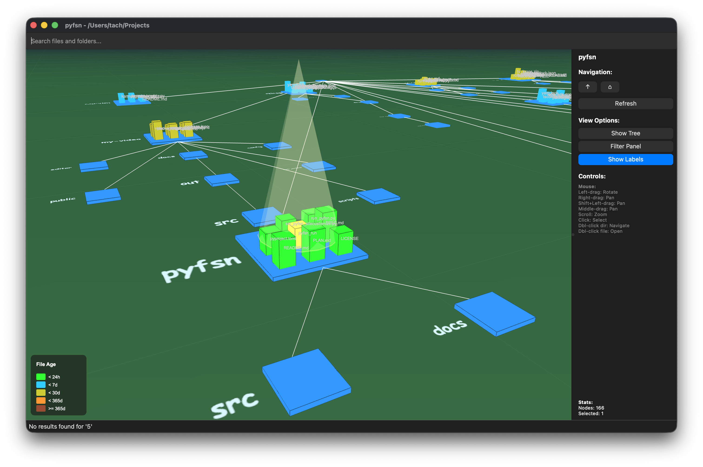

# pyfsn - Python File System Navigator

[日本語](#日本語) | [English](#english) | [中文](#中文)

---

<a name="日本語"></a>
# 日本語

SGI IRIX の fsn（ジュラシック・パークで「ドアをロック」するシーンで使われた伝説のインターフェース）にインスパイアされた、3D インタラクティブファイルシステム可視化ツール。


## スクリーンショット


It's a Unix System... I know this.

## 概要

pyfsn はファイルシステムを没入感のある 3D 空間で可視化します。ディレクトリはプラットフォームとして、ファイルはその上のキューブとして表示され、高さはファイルサイズを、色はファイルの新旧を示します。3D 空間を自由に移動しながらファイルシステムを探索できます。

## 機能

- **3D 可視化**: インタラクティブな 3D 空間でディレクトリ構造を探索
- **2 種類のカメラモード**: オービット（回転/ズーム/パン）とフライ（FPS スタイル WASD + マウスルック・衝突判定付き）
- **GPU アクセラレーション描画**: 互換性のための PyOpenGL（Legacy OpenGL 2.1）; ModernGL レンダラーも利用可能
- **スポットライト付きリアルタイム検索**: 一致するノードをコーンスポットライトでハイライトする視覚的検索エフェクト
- **高度なフィルタリング**: サイズ・日時・種類によるフィルタリング（コンテキスト保持）
- **ワイヤー接続**: ディレクトリ間の親子関係を視覚化
- **ファイル年齢カラー**: 更新日時による色分け（SGI fsn スタイル）
- **ファイルツリービュー**: 3D 可視化と並列した従来の階層ビュー
- **メディアプレビュー**: 画像ファイルにホバーでサムネイル表示；動画ファイルは 4 シーンのダイジェスト再生（バックグラウンドスレッド）
- **テーマシステム**: 複数テーマ（SGI Classic、Dark Mode、Cyberpunk、Solarized など）
- **ブルーム & 発光エフェクト**: ファイルタイプ別グロウエフェクトとアニメーションワイヤーパルス
- **2D ミニマップ**: 3D シーンのレーダー風オーバービュー
- **パフォーマンス最適化**: フラスタムカリングと Level-of-Detail (LOD) ユーティリティ
- **クロスプラットフォーム**: Linux、macOS、Windows に対応

## インストール

### 必要要件

- Python 3.10 以上
- PyQt6
- PyOpenGL
- NumPy

### ソースからインストール

```bash
git clone https://github.com/jpneagle/pyfsn.git
cd pyfsn
pip install -e .
```

### オプション依存関係

動画サムネイルサポート:
```bash
pip install -e ".[video]"
# または
pip install opencv-python
```

GPU アクセラレーション:
```bash
pip install -e ".[legacy]"
# または
pip install PyOpenGL-accelerate
```

### 依存関係を手動でインストール

```bash
# コア依存関係
pip install PyQt6 PyOpenGL numpy

# オプション: 動画プレビューサポート
pip install opencv-python

# オプション: GPU アクセラレーション
pip install PyOpenGL-accelerate
```

## 使い方

### 基本的な使い方

```bash
# カレントディレクトリを可視化
python -m pyfsn

# 指定ディレクトリを可視化
python -m pyfsn /path/to/directory

# ホームディレクトリを可視化
python -m pyfsn ~
```

### ユーザーインターフェース

pyfsn ウィンドウは以下で構成されます:

- **メインビューポート**: ファイルシステムの 3D 可視化
- **コントロールパネル**（右）: ナビゲーションコントロール、フライモード切り替え、表示オプション、統計情報
- **検索バー**（上）: リアルタイムファイル検索
- **ファイルツリーパネル**（ドッキング可能）: 階層ファイルツリービュー
- **ステータスバー**（下）: 現在のパスとステータスメッセージ
- **メニューバー**: ファイル、表示、ヘルプメニュー

### 可視化ガイド

#### 視覚的メタファー

| 要素 | 視覚的表現 | 意味 |
|------|-----------|------|
| **ディレクトリ** | 大きなプラットフォーム（青） | フォルダ/ディレクトリ |
| **ファイル** | プラットフォーム上のキューブ | ファイル |
| **キューブの高さ** | ファイルサイズに比例 | 大きいファイル = 高いキューブ |
| **キューブの色** | ファイルの年齢（SGI fsn スタイル） | 緑=24時間以内、シアン=7日以内、黄=30日以内、橙=365日以内、茶=365日以上 |
| **ワイヤーの色** | 白いライン | 親子ディレクトリの接続 |
| **黄色いグロウ** | 選択アイテム | 現在選択中のファイル/フォルダ |
| **ハイライトされたワイヤー** | 黄色の太いライン | 選択ノードへの/からの接続 |
| **ファイルのダブルクリック** | デフォルトアプリで開く | システムデフォルトアプリでファイルを開く |
| **ディレクトリ名（地面）** | 地面上の手書きテキスト | SGI fsn スタイルのディレクトリラベル |
| **ファイル名** | 常に表示 | ファイルの隣に表示されるファイル名 |
| **画像/動画にホバー** | サムネイル付きツールチップ | 画像はサムネイル、動画はダイナミックシーン再生 |

### コントロール一覧

#### マウスコントロール - 3D ビュー（オービットモード）
| 操作 | アクション |
|------|-----------|
| **左ドラッグ** | カメラを回転 |
| **右ドラッグ** | カメラをパン |
| **Shift+左ドラッグ** | カメラをパン（macOS トラックパッド代替） |
| **中ボタンドラッグ** | カメラをパン |
| **スクロールホイール** | ズームイン/アウト |
| **クリック** | ノードを選択 |
| **ディレクトリをダブルクリック** | ディレクトリに移動（カレントディレクトリ変更） |
| **ファイルをダブルクリック** | デフォルトアプリでファイルを開く |

#### マウスコントロール - 3D ビュー（フライモード）
| 操作 | アクション |
|------|-----------|
| **左ドラッグ** | 見回す（視点を回転） |
| **右ドラッグ** | 見回す（視点を回転） |
| **クリック** | ノードを選択 |
| **ディレクトリをダブルクリック** | ディレクトリに移動 |
| **ファイルをダブルクリック** | デフォルトアプリでファイルを開く |

#### マウスコントロール - ファイルツリー
| 操作 | アクション |
|------|-----------|
| **クリック** | アイテムを選択して 3D ビューでナビゲート |
| **ダブルクリック** | ファイルを開く / ディレクトリに移動 |

#### キーボードコントロール - フライモード（フライモード有効時）
| キー | アクション |
|------|-----------|
| `W` | 前進 |
| `S` | 後退 |
| `A` | 左ストレイフ |
| `D` | 右ストレイフ |
| `Q` | 下降 |
| `E` | 上昇 |
| `Shift`（ホールド） | スプリント（2倍速） |

#### キーボードコントロール - アプリケーション（メニューショートカット）
| キー | アクション |
|------|-----------|
| `Ctrl+O` | ディレクトリダイアログを開く |
| `Ctrl+T` | ファイルツリーパネルの切り替え |
| `Ctrl+F` | フィルターパネルの切り替え |
| `Ctrl+L` | ファイル名ラベルの切り替え |
| `F5` | 現在のビューを更新 |
| `Ctrl+Q` | アプリケーションを終了 |

注: フライモードの切り替えはコントロールパネルのボタンを使用してください。飛行中は衝突判定が有効です。背景をクリックすると選択が解除されます。

### 検索機能

検索バーはビジュアルスポットライトエフェクト付きの即時ファイル/フォルダ検索を提供します:

1. **アクティブ化**: 検索バーをクリック
2. **入力**: 検索語を入力（大文字小文字を区別しない）
3. **視覚的フィードバック**: 一致するノードは完全な不透明度でハイライト、非一致ノードは暗くなる
4. **ナビゲート**: 矢印キーを使用するかファイルツリーの結果をクリック
5. **ジャンプ**: Enter キーを押して選択した結果にナビゲート

**スポットライト可視化:**
- 一致するノードは 100% 不透明度でオリジナルカラーで表示
- 非一致ノードは 30% 不透明度に暗くなり彩度が下がる
- 一致するノードの上にシアン色のコーンスポットライトが現れる
- スムーズな 300ms フェードイン/フェードアウトアニメーション
- 検索結果は 3D ビューで即座に表示

検索対象:
- ファイルとフォルダ名
- 部分一致（例: "doc" は "document.txt" に一致）
- ファイル拡張子（例: ".py" でPythonファイルをすべて検索）

### ファイルツリーパネル

階層ファイルツリーは以下を提供します:

- **構造ビュー**: ディレクトリの従来のツリービュー
- **カラム**: 名前、サイズ、種類
- **クリックでナビゲート**: アイテムをクリックして 3D ビューでジャンプ
- **同期**: 選択は 3D ビューと同期
- **ドッキング可能**: 移動またはリサイズ可能

### ノードラベル

pyfsn は 2 種類のラベルを表示します:

**ディレクトリ名**（常に表示）:
- プラットフォームの隣の地面に手書きスタイルで表示（SGI fsn スタイル）
- 重複を避けるよう自動配置
- Ctrl+L の切り替えに影響されない

**ファイル名**（`Ctrl+L` で切り替え）:
- 3D ビューのファイルキューブの隣に表示
- フォーカスされたノードは大きなテキストでハイライト
- カメラ移動に合わせて自動的に位置を更新

## プロジェクト構造

```
pyfsn/
├── src/pyfsn/
│   ├── __init__.py
│   ├── __main__.py          # アプリケーションエントリポイント
│   ├── run.py               # CLI エントリポイント (pyfsn コマンド)
│   ├── errors.py            # エラー処理ユーティリティ
│   ├── model/               # モデル層
│   │   ├── node.py          # ファイル/ディレクトリ表現のノードクラス
│   │   └── scanner.py       # 非同期ファイルシステムスキャナー
│   ├── layout/              # レイアウトエンジン
│   │   ├── position.py      # 3D 位置クラス
│   │   ├── box.py           # バウンディングボックス計算
│   │   └── engine.py        # レイアウト計算エンジン
│   ├── view/                # ビュー層
│   │   ├── renderer.py      # Legacy OpenGL レンダラーウィジェット
│   │   ├── modern_renderer.py # ModernGL レンダラー（代替）
│   │   ├── camera.py        # 3D カメラシステム
│   │   ├── cube_geometry.py # GPU インスタンスキューブ（ModernGL）
│   │   ├── shaders.py       # GLSL シェーダープログラム（ModernGL）
│   │   ├── shader_loader.py # シェーダーコンパイル & キャッシング
│   │   ├── shaders/         # GLSL シェーダーファイル
│   │   │   ├── cube.vert/frag    # キューブシェーダー
│   │   │   ├── emissive.vert/frag # 発光マテリアルシェーダー
│   │   │   ├── ground.vert/frag  # 地面プレーンシェーダー
│   │   │   ├── sky.vert/frag     # スカイグラデーションシェーダー
│   │   │   └── wire.vert/frag    # ワイヤー接続シェーダー
│   │   ├── bloom.py         # ブルーム & 発光エフェクト
│   │   ├── spotlight.py     # スポットライト検索可視化
│   │   ├── filter_panel.py  # 高度なフィルタリングパネル
│   │   ├── mini_map.py      # 2D レーダースタイルミニマップ
│   │   ├── theme.py         # テーマ定義
│   │   ├── theme_manager.py # テーマ管理 & 永続化
│   │   ├── buffer_manager.py # VBO/VAO/EBO 管理
│   │   ├── texture_manager.py # テクスチャ管理
│   │   ├── picking.py       # レイ-AABB ピッキングシステム
│   │   ├── performance.py   # パフォーマンス監視
│   │   ├── effects_demo.py  # エフェクトデモアプリケーション
│   │   └── main_window.py   # UI 付きメインウィンドウ
│   └── controller/          # コントローラー層
│       ├── input_handler.py # マウス/キーボード処理
│       └── controller.py    # メインアプリケーションコントローラー
├── tests/
│   ├── test_spotlight.py    # スポットライト機能ユニットテスト
│   └── test_spotlight_demo.py # スポットライトインタラクティブデモ
└── docs/
    ├── API.md               # API ドキュメント
    ├── SPEC.md              # 技術仕様書（日本語）
    ├── FEATURE.md           # 機能ロードマップ
    ├── MEDIA_PREVIEW.md     # メディアプレビュー機能ドキュメント
    ├── ADVANCED_EFFECTS.md  # ブルーム/発光/ワイヤーパルスエフェクトドキュメント
    ├── EFFECTS_IMPLEMENTATION_SUMMARY.md # エフェクト実装サマリー
    └── screenshot.png       # アプリケーションスクリーンショット
```

## パフォーマンス

### ベンチマーク

| ファイル数 | FPS（平均） | 読み込み時間 |
|-----------|-----------|------------|
| 1,000 | 60 | 1秒未満 |
| 10,000 | 45-60 | 2-3秒 |
| 100,000 | 30-45 | 10-15秒 |

### 最適化機能

- **PyOpenGL レガシーモード**: 互換性のためのイミディエートモード描画
- **フラスタムカリング**: `paintGL()` でカメラ更新と `is_node_visible()` チェックに使用
- **Level of Detail (LOD)**: 距離ベースのエッジ描画スキップと小キューブカリング（部分的に実装）
- **プログレッシブローディング**: バッチローディングユーティリティ（実装済み、レンダラーへの接続は未完了）
- **ワイヤー接続ハイライト**: 選択した接続のみハイライト
- **衝突判定**: フライモードでの AABB ベース衝突（地面、プラットフォーム、ファイルキューブ）

## 開発

### テストの実行

```bash
# 全テストを実行
pytest

# カバレッジ付きで実行
pytest --cov=pyfsn
```

### コードスタイル

このプロジェクトでは以下を使用:
- リントとフォーマットに **Ruff**
- Python 3.10+ 型ヒント
- 全パブリック API へのドキュメント文字列

```bash
# コードスタイルのチェック
ruff check src/

# コードのフォーマット
ruff format src/
```

## アーキテクチャ

pyfsn は Model-View-Controller (MVC) パターンに従います:

- **モデル層**: ファイルシステムデータを表現（Node、Scanner）
- **ビュー層**: 描画と UI を処理（Renderer、ModernGLRenderer、Camera、MainWindow、Theme、MiniMap など）
- **コントローラー層**: 層間を調整（Controller、InputHandler）
- **レイアウトエンジン**: 可視化のための 3D 位置を計算

## API ドキュメント

詳細な API ドキュメントは [docs/API.md](docs/API.md) を参照してください。
技術仕様書（日本語）は [docs/SPEC.md](docs/SPEC.md) を参照してください。
機能ロードマップは [docs/FEATURE.md](docs/FEATURE.md) を参照してください。
メディアプレビュー機能ドキュメントは [docs/MEDIA_PREVIEW.md](docs/MEDIA_PREVIEW.md) を参照してください。
ブルーム/発光/ワイヤーパルスエフェクトのドキュメントは [docs/ADVANCED_EFFECTS.md](docs/ADVANCED_EFFECTS.md) を参照してください。

## クイックリファレンス

### キーボードショートカットチートシート

```
┌─────────────────────────────────────────────────────────┐
│ アプリケーション（メニューショートカット）                   │
├─────────────────────────────────────────────────────────┤
│ Ctrl+O      ディレクトリを開く                            │
│ Ctrl+T      ファイルツリーの切り替え                       │
│ Ctrl+F      フィルターパネルの切り替え                     │
│ Ctrl+L      ラベルの切り替え                              │
│ F5          更新                                         │
│ Ctrl+Q      終了                                         │
├─────────────────────────────────────────────────────────┤
│ フライモード（有効時）                                     │
├─────────────────────────────────────────────────────────┤
│ W/S         前進 / 後退                                  │
│ A/D         左ストレイフ / 右ストレイフ                    │
│ Q/E         下降 / 上昇                                  │
│ Shift       スプリント（2倍速）                           │
│ 左/右ドラッグ  見回す                                     │
└─────────────────────────────────────────────────────────┘
```

## トラブルシューティング

### よくある問題

#### アプリケーションが起動しない

**問題**: `ImportError: No module named 'PyQt6'`

**解決策**: 依存関係をインストール:
```bash
pip install PyQt6 PyOpenGL numpy
```

#### OpenGL エラー

**問題**: `OpenGL.error.GLError: Error during initialization` または黒い画面

**解決策**: グラフィックスドライバーが最新であることを確認してください。PyOpenGL は OpenGL 2.1+ のサポートが必要です。

#### パフォーマンスが低い

**問題**: 大きなディレクトリで FPS が低い

**解決策**:
1. GPU を使用する他のアプリケーションを閉じる
2. ノードラベルを無効化（`Ctrl+L`）してオーバーレイ描画を削減
3. ファイルツリーパネルを閉じて UI のオーバーヘッドを削減

#### パーミッション拒否エラー

**問題**: 一部のディレクトリがアクセス不可として表示される

**解決策**: pyfsn は読み取り権限のないディレクトリをスキップします。必要に応じて適切な権限で実行してください:
```bash
sudo python -m pyfsn  # Linux/macOS の場合
# Windows では管理者として実行
```

#### 黒い画面

**問題**: 何もレンダリングされず、黒い画面のみ

**解決策**:
1. コンテンツのあるディレクトリを使用していることを確認
2. `Ctrl+O` でディレクトリを再度開いてみる
3. OpenGL の互換性を確認: `python -c "from OpenGL.GL import *; print(glGetString(GL_VERSION))"`

#### ファイルが開かない

**問題**: ファイルをダブルクリックしてもエラーが表示されるか何も起きない

**解決策**:
1. ファイルのパーミッションを確認: 読み取りアクセス権があることを確認
2. ファイルの関連付けを確認: ファイルタイプにデフォルトアプリケーションがあることを確認
3. macOS: ターミナルで `open /path/to/file` を実行してテスト
4. Windows: コマンドプロンプトで `start "" "C:\path\to\file"` を実行してテスト
5. Linux: ターミナルで `xdg-open /path/to/file` を実行してテスト
6. 詳細なエラーメッセージのためにアプリケーションログを確認

#### テキストラベルが表示されない

**問題**: ディレクトリ名またはファイル名が表示されない

**解決策**:
1. ラベルが有効であることを確認: Ctrl+L を押して切り替え
2. 一部のラベルは衝突判定により非表示になる場合がある
3. ズームアウトして、さらに遠くに配置されたラベルを確認

### パフォーマンスのヒント

1. **大きなファイルシステム**（100,000 ファイル以上）:
   - ナビゲーションにファイルツリーパネルを使用
   - ノードラベルを無効化（`Ctrl+L`）
   - 使用していない場合はフィルターパネルを閉じる

2. **ローエンド GPU**:
   - ノードラベルを無効化（`Ctrl+L`）
   - ファイルツリーパネルを閉じる

3. **ネットワークドライブ**:
   - 初回スキャンが遅くなる場合がある
   - 頻繁にアクセスするドライブのキャッシングを検討

## コントリビューション

コントリビューションを歓迎します！プルリクエストをお気軽に送ってください。

コントリビューションの対象:
- より多くのファイルタイプカラースキーム
- カスタム可視化のためのプラグインシステム
- パフォーマンスの最適化
- ドキュメントの改善

## ライセンス

MIT ライセンス - 詳細は [LICENSE](LICENSE) を参照してください。

## 謝辞

- **PyQt6**: GUI フレームワーク
- **PyOpenGL**: OpenGL バインディング
- **NumPy**: 数値計算

---

<a name="english"></a>
# English

A 3D interactive file system visualization tool inspired by SGI IRIX fsn—the legendary interface used in Jurassic Park to "lock the door."


## Screenshot


It's a Unix System... I know this.

## Overview

pyfsn provides an immersive 3D visualization of your file system. Directories appear as platforms, files as cubes on those platforms, with height representing file size and color indicating file age. Navigate freely through your file system in 3D space.

## Features

- **3D Visualization**: Explore directory structures in an interactive 3D space
- **Dual Camera Modes**: Orbit (rotate/zoom/pan) and Fly (FPS-style WASD + Mouse Look with collision detection)
- **GPU-Accelerated Rendering**: PyOpenGL (Legacy OpenGL 2.1) for compatibility; ModernGL renderer also available
- **Real-time Search with Spotlight**: Visual search effects that highlight matching nodes with cone spotlights
- **Advanced Filtering**: Filter by size, age, and type with context preservation
- **Wire Connections**: Visual parent-child relationships between directories
- **File Age Colors**: Color-coded by modification time (SGI fsn style)
- **File Tree View**: Traditional hierarchical view alongside 3D visualization
- **Media Previews**: Hover over image files for thumbnails; video files show dynamic 4-scene digest playback (background threaded)
- **Theme System**: Multiple themes (SGI Classic, Dark Mode, Cyberpunk, Solarized, etc.)
- **Bloom & Emissive Effects**: File type-based glow effects and animated wire pulses
- **2D Mini Map**: Radar-style overview of the 3D scene
- **Performance Optimization**: Frustum culling and Level-of-Detail (LOD) utilities
- **Cross-Platform**: Works on Linux, macOS, and Windows

## Installation

### Requirements

- Python 3.10 or higher
- PyQt6
- PyOpenGL
- NumPy

### Install from source

```bash
git clone https://github.com/jpneagle/pyfsn.git
cd pyfsn
pip install -e .
```

### Optional dependencies

For video thumbnail support:
```bash
pip install -e ".[video]"
# or
pip install opencv-python
```

For GPU acceleration:
```bash
pip install -e ".[legacy]"
# or
pip install PyOpenGL-accelerate
```

### Install dependencies manually

```bash
# Core dependencies
pip install PyQt6 PyOpenGL numpy

# Optional: Video preview support
pip install opencv-python

# Optional: GPU acceleration
pip install PyOpenGL-accelerate
```

## Usage

### Basic Usage

```bash
# Visualize current directory
python -m pyfsn

# Visualize specific directory
python -m pyfsn /path/to/directory

# Visualize home directory
python -m pyfsn ~
```

### User Interface

The pyfsn window consists of:

- **Main Viewport**: 3D visualization of your file system
- **Control Panel** (right): Navigation controls, Fly Mode toggle, view options, statistics
- **Search Bar** (top): Real-time file search
- **File Tree Panel** (dockable): Hierarchical file tree view
- **Status Bar** (bottom): Current path and status messages
- **Menu Bar**: File, View, and Help menus

### Visualization Guide

#### Visual Metaphors

| Element | Visual Representation | Meaning |
|---------|---------------------|---------|
| **Directory** | Large platform (blue) | A folder/directory |
| **File** | Cube on platform | A file |
| **Cube Height** | Proportional to file size | Larger files = taller cubes |
| **Cube Color** | By file age (SGI fsn style) | Green=&lt;24h, Cyan=&lt;7d, Yellow=&lt;30d, Orange=&lt;365d, Brown≥365d |
| **Wire Color** | White lines | Parent-child directory connections |
| **Yellow Glow** | Selected item | Currently selected file/folder |
| **Highlighted Wire** | Yellow thick lines | Connections to/from selected nodes |
| **Double-click File** | Opens in default app | Open file with system default application |
| **Directory Name (Ground)** | Handwritten text on ground | SGI fsn style directory label |
| **File Names** | Always visible | File names shown next to files |
| **Hover Image/Video** | Tooltip with preview | Shows thumbnail for images, dynamic scene playback for videos |

### Controls Reference

#### Mouse Controls - 3D View (Orbit Mode)
| Action | Operation |
|--------|-----------|
| **Left-drag** | Rotate camera |
| **Right-drag** | Pan camera |
| **Shift+Left-drag** | Pan camera (macOS trackpad alternative) |
| **Middle-drag** | Pan camera |
| **Scroll wheel** | Zoom in/out |
| **Click** | Select node |
| **Double-click directory** | Navigate to directory (change current directory) |
| **Double-click file** | Open file with default application |

#### Mouse Controls - 3D View (Fly Mode)
| Action | Operation |
|--------|-----------|
| **Left-drag** | Look around (rotate view) |
| **Right-drag** | Look around (rotate view) |
| **Click** | Select node |
| **Double-click directory** | Navigate to directory |
| **Double-click file** | Open file with default application |

#### Mouse Controls - File Tree
| Action | Operation |
|--------|-----------|
| **Click** | Select and navigate to item |
| **Double-click** | Open file / Navigate to directory |

#### Keyboard Controls - Fly Mode (when Fly Mode is active)
| Key | Action |
|-----|--------|
| `W` | Move forward |
| `S` | Move backward |
| `A` | Strafe left |
| `D` | Strafe right |
| `Q` | Move down |
| `E` | Move up |
| `Shift` (hold) | Sprint (2x speed) |

#### Keyboard Controls - Application (Menu Shortcuts)
| Key | Action |
|-----|--------|
| `Ctrl+O` | Open directory dialog |
| `Ctrl+T` | Toggle file tree panel |
| `Ctrl+F` | Toggle filter panel |
| `Ctrl+L` | Toggle file name labels |
| `F5` | Refresh current view |
| `Ctrl+Q` | Exit application |

Note: Use the Control Panel button to toggle Fly Mode. Collision detection is enabled during flight. Click the background to deselect.

### Search Functionality

The search bar provides instant file/folder search with visual spotlight effects:

1. **Activate**: Click the search bar
2. **Type**: Enter search term (case-insensitive)
3. **Visual Feedback**: Matching nodes are highlighted at full opacity, non-matching nodes are dimmed
4. **Navigate**: Use arrow keys or click results in the file tree
5. **Jump**: Press Enter to navigate to the selected result

**Spotlight Visualization:**
- Matching nodes displayed at 100% opacity with original colors
- Non-matching nodes dimmed to 30% opacity and desaturated
- Cyan-tinted cone spotlights appear above matching nodes
- Smooth 300ms fade-in/fade-out animations
- Search results are immediately visible in the 3D view

Search finds:
- File and folder names
- Partial matches (e.g., "doc" matches "document.txt")
- File extensions (e.g., ".py" finds all Python files)

### File Tree Panel

The hierarchical file tree provides:

- **Structure view**: Traditional tree view of directories
- **Columns**: Name, Size, Type
- **Click to navigate**: Click any item to jump to it in 3D view
- **Sync**: Selection syncs with 3D view
- **Dockable**: Can be moved or resized

### Node Labels

pyfsn displays labels in two ways:

**Directory Names** (always visible):
- Displayed on the ground next to platforms in handwritten style (SGI fsn style)
- Automatically positioned to avoid overlapping
- Not affected by Ctrl+L toggle

**File Names** (toggle with `Ctrl+L`):
- Shown next to file cubes in the 3D view
- Focused node highlighted with larger text
- Automatic position updates as camera moves

## Project Structure

```
pyfsn/
├── src/pyfsn/
│   ├── __init__.py
│   ├── __main__.py          # Application entry point
│   ├── run.py               # CLI entry point (pyfsn command)
│   ├── errors.py            # Error handling utilities
│   ├── model/               # Model layer
│   │   ├── node.py          # Node class for file/directory representation
│   │   └── scanner.py       # Async filesystem scanner
│   ├── layout/              # Layout engine
│   │   ├── position.py      # 3D position classes
│   │   ├── box.py           # Bounding box calculations
│   │   └── engine.py        # Layout calculation engine
│   ├── view/                # View layer
│   │   ├── renderer.py      # Legacy OpenGL renderer widget
│   │   ├── modern_renderer.py # ModernGL renderer (alternative)
│   │   ├── camera.py        # 3D camera system
│   │   ├── cube_geometry.py # GPU instanced cubes (ModernGL)
│   │   ├── shaders.py       # GLSL shader programs (ModernGL)
│   │   ├── shader_loader.py # Shader compilation & caching
│   │   ├── shaders/         # GLSL shader files
│   │   │   ├── cube.vert/frag    # Cube shaders
│   │   │   ├── emissive.vert/frag # Emissive material shaders
│   │   │   ├── ground.vert/frag  # Ground plane shaders
│   │   │   ├── sky.vert/frag     # Sky gradient shaders
│   │   │   └── wire.vert/frag    # Wire connection shaders
│   │   ├── bloom.py         # Bloom & emissive effects
│   │   ├── spotlight.py     # Spotlight search visualization
│   │   ├── filter_panel.py  # Advanced filtering panel
│   │   ├── mini_map.py      # 2D radar-style mini map
│   │   ├── theme.py         # Theme definitions
│   │   ├── theme_manager.py # Theme management & persistence
│   │   ├── buffer_manager.py # VBO/VAO/EBO management
│   │   ├── texture_manager.py # Texture management
│   │   ├── picking.py       # Ray-AABB picking system
│   │   ├── performance.py   # Performance monitoring
│   │   ├── effects_demo.py  # Effects demo application
│   │   └── main_window.py   # Main window with UI
│   └── controller/          # Controller layer
│       ├── input_handler.py # Mouse/keyboard handling
│       └── controller.py    # Main application controller
├── tests/
│   ├── test_spotlight.py    # Spotlight feature unit tests
│   └── test_spotlight_demo.py # Spotlight interactive demo
└── docs/
    ├── API.md               # API documentation
    ├── SPEC.md              # Technical specifications (Japanese)
    ├── FEATURE.md           # Feature roadmap
    ├── MEDIA_PREVIEW.md     # Media preview feature docs
    ├── ADVANCED_EFFECTS.md  # Bloom/emissive/wire pulse effects docs
    ├── EFFECTS_IMPLEMENTATION_SUMMARY.md # Effects implementation summary
    └── screenshot.png       # Application screenshot
```

## Performance

### Benchmarks

| File Count | FPS (Avg) | Load Time |
|------------|-----------|-----------|
| 1,000 | 60 | < 1s |
| 10,000 | 45-60 | 2-3s |
| 100,000 | 30-45 | 10-15s |

### Optimization Features

- **PyOpenGL Legacy Mode**: Immediate mode rendering for compatibility
- **Frustum Culling**: Used in `paintGL()` for camera updates and `is_node_visible()` checks
- **Level of Detail (LOD)**: Distance-based edge rendering skip and small cube culling (partially wired)
- **Progressive Loading**: Utility for batch loading (implemented, not yet wired to renderer)
- **Wire Connection Highlighting**: Only highlight selected connections
- **Collision Detection**: AABB-based collision for Fly mode (ground, platforms, file cubes)

## Development

### Running Tests

```bash
# Run all tests
pytest

# Run with coverage
pytest --cov=pyfsn
```

### Code Style

This project uses:
- **Ruff** for linting and formatting
- Python 3.10+ type hints
- Docstrings for all public APIs

```bash
# Check code style
ruff check src/

# Format code
ruff format src/
```

## Architecture

pyfsn follows a Model-View-Controller (MVC) pattern:

- **Model Layer**: Represents file system data (Node, Scanner)
- **View Layer**: Handles rendering and UI (Renderer, ModernGLRenderer, Camera, MainWindow, Theme, MiniMap, etc.)
- **Controller Layer**: Coordinates between layers (Controller, InputHandler)
- **Layout Engine**: Calculates 3D positions for visualization

## API Documentation

See [docs/API.md](docs/API.md) for detailed API documentation.
See [docs/SPEC.md](docs/SPEC.md) for technical specifications (in Japanese).
See [docs/FEATURE.md](docs/FEATURE.md) for feature roadmap.
See [docs/MEDIA_PREVIEW.md](docs/MEDIA_PREVIEW.md) for media preview feature documentation.
See [docs/ADVANCED_EFFECTS.md](docs/ADVANCED_EFFECTS.md) for bloom/emissive/wire pulse effects documentation.

## Quick Reference

### Keyboard Shortcuts Cheatsheet

```
┌─────────────────────────────────────────────────────────┐
│ APPLICATION (MENU SHORTCUTS)                            │
├─────────────────────────────────────────────────────────┤
│ Ctrl+O      Open directory                              │
│ Ctrl+T      Toggle file tree                            │
│ Ctrl+F      Toggle filter panel                         │
│ Ctrl+L      Toggle labels                               │
│ F5          Refresh                                     │
│ Ctrl+Q      Exit                                        │
├─────────────────────────────────────────────────────────┤
│ FLY MODE (when active)                                  │
├─────────────────────────────────────────────────────────┤
│ W/S         Forward / Backward                          │
│ A/D         Strafe Left / Right                         │
│ Q/E         Down / Up                                   │
│ Shift       Sprint (2x speed)                           │
│ L/R-Drag    Look around                                 │
└─────────────────────────────────────────────────────────┘
```

## Troubleshooting

### Common Issues

#### Application won't start

**Problem**: `ImportError: No module named 'PyQt6'`

**Solution**: Install dependencies:
```bash
pip install PyQt6 PyOpenGL numpy
```

#### OpenGL errors

**Problem**: `OpenGL.error.GLError: Error during initialization` or black screen

**Solution**: Ensure your graphics drivers are up to date. PyOpenGL requires OpenGL 2.1+ support.

#### Poor performance

**Problem**: Low FPS with large directories

**Solutions**:
1. Close other applications using GPU
2. Disable node labels (`Ctrl+L`) to reduce overlay rendering
3. Close file tree panel to reduce UI overhead

#### Permission denied errors

**Problem**: Some directories show as inaccessible

**Solution**: pyfsn will skip directories without read permissions. Run with appropriate permissions if needed:
```bash
sudo python -m pyfsn  # On Linux/macOS
# Run as Administrator on Windows
```

#### Black screen

**Problem**: Nothing renders, only black screen

**Solutions**:
1. Ensure you're using a directory with contents
2. Try reopening the directory via `Ctrl+O`
3. Check OpenGL compatibility: `python -c "from OpenGL.GL import *; print(glGetString(GL_VERSION))"`

#### File won't open

**Problem**: Double-clicking a file shows error or does nothing

**Solutions**:
1. Check file permissions: Ensure you have read access
2. Check file associations: Verify the file type has a default application
3. macOS: Run `open /path/to/file` in Terminal to test
4. Windows: Run `start "" "C:\path\to\file"` in Command Prompt to test
5. Linux: Run `xdg-open /path/to/file` in Terminal to test
6. Check application logs for detailed error messages

#### Text labels not visible

**Problem**: Directory names or file names don't appear

**Solutions**:
1. Check that labels are enabled: Press Ctrl+L to toggle
2. Some labels may be hidden due to collision detection
3. Try zooming out to see labels positioned further away

### Performance Tips

1. **Large file systems** (>100,000 files):
   - Use file tree panel for navigation
   - Disable node labels (`Ctrl+L`)
   - Close filter panel if not in use

2. **Low-end GPUs**:
   - Disable node labels (`Ctrl+L`)
   - Close file tree panel

3. **Network drives**:
   - May have slower initial scan
   - Consider caching for frequently accessed drives

## Contributing

Contributions are welcome! Please feel free to submit a Pull Request.

Areas for contribution:
- More file type color schemes
- Plugin system for custom visualizations
- Performance optimizations
- Documentation improvements

## License

MIT License - see [LICENSE](LICENSE) for details.

## Acknowledgments

- **PyQt6** for the GUI framework
- **PyOpenGL** for OpenGL bindings
- **NumPy** for numerical calculations

---

<a name="中文"></a>
# 中文

受 SGI IRIX fsn 启发的 3D 交互式文件系统可视化工具——那个在《侏罗纪公园》中用于"锁门"的传奇界面。


## 截图


It's a Unix System... I know this.

## 概述

pyfsn 提供沉浸式 3D 文件系统可视化。目录显示为平台，文件显示为平台上的方块，高度代表文件大小，颜色表示文件新旧程度。可在 3D 空间中自由浏览文件系统。

## 功能特性

- **3D 可视化**：在交互式 3D 空间中探索目录结构
- **双摄像机模式**：轨道模式（旋转/缩放/平移）和飞行模式（FPS 风格 WASD + 鼠标视角，含碰撞检测）
- **GPU 加速渲染**：PyOpenGL（传统 OpenGL 2.1）保证兼容性；同时提供 ModernGL 渲染器
- **实时搜索与聚光灯**：使用锥形聚光灯高亮匹配节点的视觉搜索效果
- **高级过滤**：按大小、时间、类型过滤，保留上下文
- **连线连接**：目录间父子关系的可视化表示
- **文件年龄颜色**：按修改时间进行颜色编码（SGI fsn 风格）
- **文件树视图**：与 3D 可视化并排的传统层级视图
- **媒体预览**：悬停在图像文件上显示缩略图；视频文件显示动态 4 场景摘要播放（后台线程）
- **主题系统**：多种主题（SGI Classic、Dark Mode、Cyberpunk、Solarized 等）
- **泛光与发光效果**：基于文件类型的辉光效果和动画连线脉冲
- **2D 小地图**：3D 场景的雷达风格概览
- **性能优化**：视锥体裁剪和细节层次（LOD）实用工具
- **跨平台**：支持 Linux、macOS 和 Windows

## 安装

### 系统要求

- Python 3.10 或更高版本
- PyQt6
- PyOpenGL
- NumPy

### 从源码安装

```bash
git clone https://github.com/jpneagle/pyfsn.git
cd pyfsn
pip install -e .
```

### 可选依赖

视频缩略图支持：
```bash
pip install -e ".[video]"
# 或
pip install opencv-python
```

GPU 加速：
```bash
pip install -e ".[legacy]"
# 或
pip install PyOpenGL-accelerate
```

### 手动安装依赖

```bash
# 核心依赖
pip install PyQt6 PyOpenGL numpy

# 可选：视频预览支持
pip install opencv-python

# 可选：GPU 加速
pip install PyOpenGL-accelerate
```

## 使用方法

### 基本用法

```bash
# 可视化当前目录
python -m pyfsn

# 可视化指定目录
python -m pyfsn /path/to/directory

# 可视化主目录
python -m pyfsn ~
```

### 用户界面

pyfsn 窗口由以下部分组成：

- **主视口**：文件系统的 3D 可视化
- **控制面板**（右侧）：导航控件、飞行模式切换、视图选项、统计信息
- **搜索栏**（顶部）：实时文件搜索
- **文件树面板**（可停靠）：层级文件树视图
- **状态栏**（底部）：当前路径和状态消息
- **菜单栏**：文件、视图和帮助菜单

### 可视化指南

#### 视觉隐喻

| 元素 | 视觉表示 | 含义 |
|------|---------|------|
| **目录** | 大型平台（蓝色） | 文件夹/目录 |
| **文件** | 平台上的方块 | 文件 |
| **方块高度** | 与文件大小成比例 | 文件越大 = 方块越高 |
| **方块颜色** | 按文件年龄（SGI fsn 风格） | 绿=24小时内，青=7天内，黄=30天内，橙=365天内，棕≥365天 |
| **连线颜色** | 白色线条 | 父子目录连接 |
| **黄色辉光** | 选中项目 | 当前选中的文件/文件夹 |
| **高亮连线** | 黄色粗线 | 与选中节点的连接 |
| **双击文件** | 用默认应用打开 | 用系统默认应用程序打开文件 |
| **目录名（地面）** | 地面上的手写文字 | SGI fsn 风格的目录标签 |
| **文件名** | 始终可见 | 文件旁边显示的文件名 |
| **悬停图像/视频** | 带预览的工具提示 | 图像显示缩略图，视频显示动态场景播放 |

### 操作参考

#### 鼠标控制 - 3D 视图（轨道模式）
| 操作 | 功能 |
|------|------|
| **左键拖拽** | 旋转摄像机 |
| **右键拖拽** | 平移摄像机 |
| **Shift+左键拖拽** | 平移摄像机（macOS 触控板替代方案） |
| **中键拖拽** | 平移摄像机 |
| **滚轮** | 缩放 |
| **点击** | 选择节点 |
| **双击目录** | 进入目录（更改当前目录） |
| **双击文件** | 用默认应用打开文件 |

#### 鼠标控制 - 3D 视图（飞行模式）
| 操作 | 功能 |
|------|------|
| **左键拖拽** | 环顾四周（旋转视角） |
| **右键拖拽** | 环顾四周（旋转视角） |
| **点击** | 选择节点 |
| **双击目录** | 进入目录 |
| **双击文件** | 用默认应用打开文件 |

#### 鼠标控制 - 文件树
| 操作 | 功能 |
|------|------|
| **点击** | 选择并在 3D 视图中定位 |
| **双击** | 打开文件 / 进入目录 |

#### 键盘控制 - 飞行模式（飞行模式激活时）
| 按键 | 功能 |
|------|------|
| `W` | 前进 |
| `S` | 后退 |
| `A` | 向左横移 |
| `D` | 向右横移 |
| `Q` | 下降 |
| `E` | 上升 |
| `Shift`（按住） | 冲刺（2倍速度） |

#### 键盘控制 - 应用程序（菜单快捷键）
| 按键 | 功能 |
|------|------|
| `Ctrl+O` | 打开目录对话框 |
| `Ctrl+T` | 切换文件树面板 |
| `Ctrl+F` | 切换过滤面板 |
| `Ctrl+L` | 切换文件名标签 |
| `F5` | 刷新当前视图 |
| `Ctrl+Q` | 退出应用程序 |

注：使用控制面板按钮切换飞行模式。飞行时启用碰撞检测。点击背景取消选择。

### 搜索功能

搜索栏提供带视觉聚光灯效果的即时文件/文件夹搜索：

1. **激活**：点击搜索栏
2. **输入**：输入搜索词（不区分大小写）
3. **视觉反馈**：匹配节点以完全不透明度高亮，不匹配节点变暗
4. **导航**：使用方向键或点击文件树中的结果
5. **跳转**：按 Enter 键导航到选中的结果

**聚光灯可视化：**
- 匹配节点以 100% 不透明度和原始颜色显示
- 不匹配节点暗化至 30% 不透明度并去饱和
- 匹配节点上方出现青色调锥形聚光灯
- 流畅的 300ms 淡入/淡出动画
- 搜索结果在 3D 视图中即时可见

搜索范围：
- 文件和文件夹名称
- 部分匹配（例如："doc" 匹配 "document.txt"）
- 文件扩展名（例如：".py" 找到所有 Python 文件）

### 文件树面板

层级文件树提供：

- **结构视图**：目录的传统树形视图
- **列**：名称、大小、类型
- **点击导航**：点击任意项目跳转到 3D 视图中的位置
- **同步**：选择与 3D 视图同步
- **可停靠**：可以移动或调整大小

### 节点标签

pyfsn 以两种方式显示标签：

**目录名称**（始终可见）：
- 以手写风格显示在平台旁边的地面上（SGI fsn 风格）
- 自动定位以避免重叠
- 不受 Ctrl+L 切换影响

**文件名**（使用 `Ctrl+L` 切换）：
- 在 3D 视图中显示在文件方块旁边
- 焦点节点以更大文字高亮
- 随摄像机移动自动更新位置

## 项目结构

```
pyfsn/
├── src/pyfsn/
│   ├── __init__.py
│   ├── __main__.py          # 应用程序入口点
│   ├── run.py               # CLI 入口点（pyfsn 命令）
│   ├── errors.py            # 错误处理工具
│   ├── model/               # 模型层
│   │   ├── node.py          # 文件/目录表示的节点类
│   │   └── scanner.py       # 异步文件系统扫描器
│   ├── layout/              # 布局引擎
│   │   ├── position.py      # 3D 位置类
│   │   ├── box.py           # 边界框计算
│   │   └── engine.py        # 布局计算引擎
│   ├── view/                # 视图层
│   │   ├── renderer.py      # 传统 OpenGL 渲染器组件
│   │   ├── modern_renderer.py # ModernGL 渲染器（替代方案）
│   │   ├── camera.py        # 3D 摄像机系统
│   │   ├── cube_geometry.py # GPU 实例化方块（ModernGL）
│   │   ├── shaders.py       # GLSL 着色器程序（ModernGL）
│   │   ├── shader_loader.py # 着色器编译与缓存
│   │   ├── shaders/         # GLSL 着色器文件
│   │   │   ├── cube.vert/frag    # 方块着色器
│   │   │   ├── emissive.vert/frag # 发光材质着色器
│   │   │   ├── ground.vert/frag  # 地面平面着色器
│   │   │   ├── sky.vert/frag     # 天空渐变着色器
│   │   │   └── wire.vert/frag    # 连线着色器
│   │   ├── bloom.py         # 泛光与发光效果
│   │   ├── spotlight.py     # 聚光灯搜索可视化
│   │   ├── filter_panel.py  # 高级过滤面板
│   │   ├── mini_map.py      # 2D 雷达风格小地图
│   │   ├── theme.py         # 主题定义
│   │   ├── theme_manager.py # 主题管理与持久化
│   │   ├── buffer_manager.py # VBO/VAO/EBO 管理
│   │   ├── texture_manager.py # 纹理管理
│   │   ├── picking.py       # 光线-AABB 拾取系统
│   │   ├── performance.py   # 性能监控
│   │   ├── effects_demo.py  # 效果演示应用程序
│   │   └── main_window.py   # 带 UI 的主窗口
│   └── controller/          # 控制器层
│       ├── input_handler.py # 鼠标/键盘处理
│       └── controller.py    # 主应用程序控制器
├── tests/
│   ├── test_spotlight.py    # 聚光灯功能单元测试
│   └── test_spotlight_demo.py # 聚光灯交互演示
└── docs/
    ├── API.md               # API 文档
    ├── SPEC.md              # 技术规格说明（日语）
    ├── FEATURE.md           # 功能路线图
    ├── MEDIA_PREVIEW.md     # 媒体预览功能文档
    ├── ADVANCED_EFFECTS.md  # 泛光/发光/连线脉冲效果文档
    ├── EFFECTS_IMPLEMENTATION_SUMMARY.md # 效果实现摘要
    └── screenshot.png       # 应用程序截图
```

## 性能

### 基准测试

| 文件数量 | FPS（平均） | 加载时间 |
|---------|-----------|---------|
| 1,000 | 60 | < 1秒 |
| 10,000 | 45-60 | 2-3秒 |
| 100,000 | 30-45 | 10-15秒 |

### 优化功能

- **PyOpenGL 传统模式**：即时模式渲染保证兼容性
- **视锥体裁剪**：在 `paintGL()` 中用于摄像机更新和 `is_node_visible()` 检查
- **细节层次（LOD）**：基于距离的边缘渲染跳过和小方块裁剪（部分实现）
- **渐进加载**：批量加载实用工具（已实现，尚未连接到渲染器）
- **连线高亮**：仅高亮选中的连接
- **碰撞检测**：飞行模式的 AABB 碰撞（地面、平台、文件方块）

## 开发

### 运行测试

```bash
# 运行所有测试
pytest

# 带覆盖率运行
pytest --cov=pyfsn
```

### 代码风格

本项目使用：
- **Ruff** 进行代码检查和格式化
- Python 3.10+ 类型提示
- 所有公共 API 的文档字符串

```bash
# 检查代码风格
ruff check src/

# 格式化代码
ruff format src/
```

## 架构

pyfsn 遵循模型-视图-控制器（MVC）模式：

- **模型层**：表示文件系统数据（Node、Scanner）
- **视图层**：处理渲染和 UI（Renderer、ModernGLRenderer、Camera、MainWindow、Theme、MiniMap 等）
- **控制器层**：协调各层（Controller、InputHandler）
- **布局引擎**：计算可视化的 3D 位置

## API 文档

详细 API 文档请参阅 [docs/API.md](docs/API.md)。
技术规格说明（日语）请参阅 [docs/SPEC.md](docs/SPEC.md)。
功能路线图请参阅 [docs/FEATURE.md](docs/FEATURE.md)。
媒体预览功能文档请参阅 [docs/MEDIA_PREVIEW.md](docs/MEDIA_PREVIEW.md)。
泛光/发光/连线脉冲效果文档请参阅 [docs/ADVANCED_EFFECTS.md](docs/ADVANCED_EFFECTS.md)。

## 快速参考

### 键盘快捷键速查表

```
┌─────────────────────────────────────────────────────────┐
│ 应用程序（菜单快捷键）                                    │
├─────────────────────────────────────────────────────────┤
│ Ctrl+O      打开目录                                     │
│ Ctrl+T      切换文件树                                   │
│ Ctrl+F      切换过滤面板                                  │
│ Ctrl+L      切换标签                                     │
│ F5          刷新                                         │
│ Ctrl+Q      退出                                         │
├─────────────────────────────────────────────────────────┤
│ 飞行模式（激活时）                                        │
├─────────────────────────────────────────────────────────┤
│ W/S         前进 / 后退                                  │
│ A/D         向左横移 / 向右横移                           │
│ Q/E         下降 / 上升                                  │
│ Shift       冲刺（2倍速度）                               │
│ 左/右拖拽    环顾四周                                     │
└─────────────────────────────────────────────────────────┘
```

## 故障排除

### 常见问题

#### 应用程序无法启动

**问题**：`ImportError: No module named 'PyQt6'`

**解决方案**：安装依赖：
```bash
pip install PyQt6 PyOpenGL numpy
```

#### OpenGL 错误

**问题**：`OpenGL.error.GLError: Error during initialization` 或黑屏

**解决方案**：确保显卡驱动程序是最新版本。PyOpenGL 需要 OpenGL 2.1+ 支持。

#### 性能差

**问题**：大型目录下帧率低

**解决方案**：
1. 关闭其他使用 GPU 的应用程序
2. 禁用节点标签（`Ctrl+L`）减少叠加渲染
3. 关闭文件树面板减少 UI 开销

#### 权限拒绝错误

**问题**：某些目录显示为不可访问

**解决方案**：pyfsn 将跳过没有读取权限的目录。如需访问，请以适当权限运行：
```bash
sudo python -m pyfsn  # 在 Linux/macOS 上
# 在 Windows 上以管理员身份运行
```

#### 黑屏

**问题**：什么都不渲染，只有黑屏

**解决方案**：
1. 确保使用包含内容的目录
2. 尝试通过 `Ctrl+O` 重新打开目录
3. 检查 OpenGL 兼容性：`python -c "from OpenGL.GL import *; print(glGetString(GL_VERSION))"`

#### 文件无法打开

**问题**：双击文件显示错误或没有反应

**解决方案**：
1. 检查文件权限：确保有读取访问权限
2. 检查文件关联：验证文件类型有默认应用程序
3. macOS：在终端运行 `open /path/to/file` 进行测试
4. Windows：在命令提示符运行 `start "" "C:\path\to\file"` 进行测试
5. Linux：在终端运行 `xdg-open /path/to/file` 进行测试
6. 检查应用程序日志以获取详细错误信息

#### 文字标签不可见

**问题**：目录名或文件名不显示

**解决方案**：
1. 检查标签是否启用：按 Ctrl+L 切换
2. 某些标签可能因碰撞检测而隐藏
3. 尝试缩小查看位置更远的标签

### 性能提示

1. **大型文件系统**（超过 100,000 个文件）：
   - 使用文件树面板进行导航
   - 禁用节点标签（`Ctrl+L`）
   - 不使用时关闭过滤面板

2. **低端 GPU**：
   - 禁用节点标签（`Ctrl+L`）
   - 关闭文件树面板

3. **网络驱动器**：
   - 初始扫描可能较慢
   - 考虑为频繁访问的驱动器使用缓存

## 贡献

欢迎贡献！请随时提交 Pull Request。

贡献领域：
- 更多文件类型颜色方案
- 自定义可视化的插件系统
- 性能优化
- 文档改进

## 许可证

MIT 许可证 - 详情请参阅 [LICENSE](LICENSE)。

## 致谢

- **PyQt6**：GUI 框架
- **PyOpenGL**：OpenGL 绑定
- **NumPy**：数值计算
